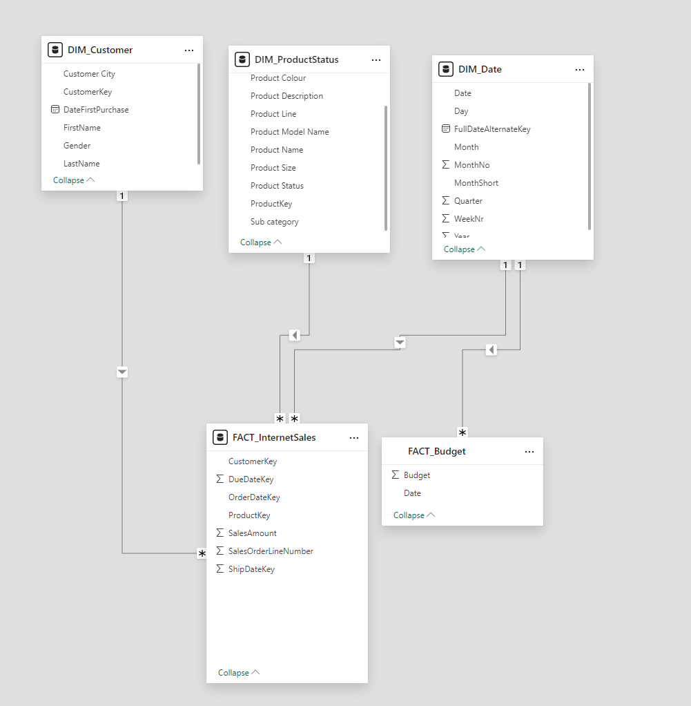
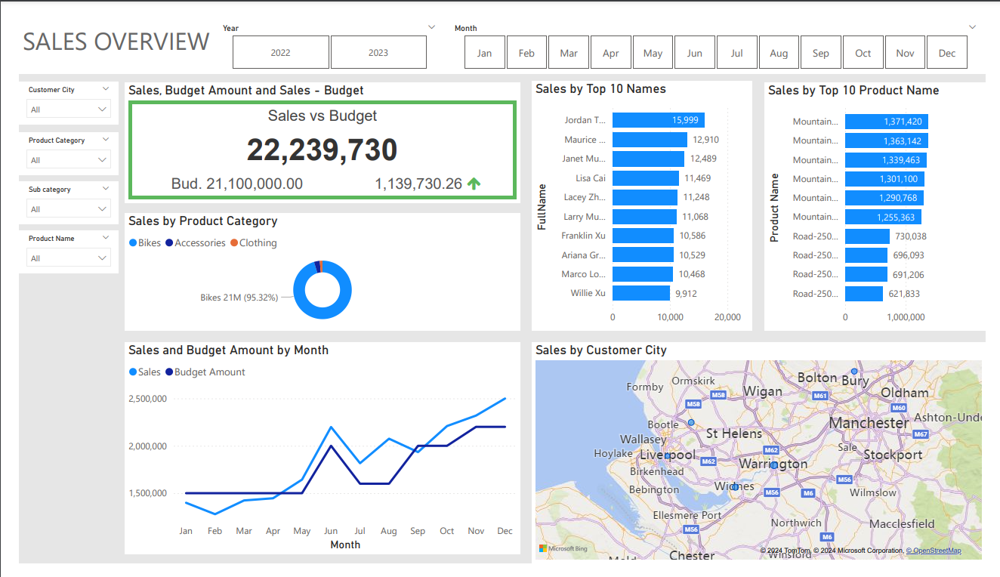

# Background

This project aimed to address the challenges faced by the sales team at a fictional bicycle company ([AdventureWorks](https://learn.microsoft.com/en-us/sql/samples/adventureworks-install-configure?view=sql-server-ver15&tabs=ssms)) in generating and analysing sales reports. By transitioning from static reports to interactive dashboards, the goal was to provide a more comprehensive and actionable view of sales performance.

## Email sent from Sales Manager

>Hi Adam

>I hope you are well, we need to **improve our internet sales reports** and want to move from static reports to **visual dashboards**. Essentially, we want to focus on how much we have **sold of what products**, **to which clients** and **how it has been over time**. Seeing as each **salesperson** works on different products and customers it would be beneficial to be able to **filter them too**. We measure our numbers against **budget** so I added that in a **spreadsheet** so we can compare our values against performance. The budget is in for 2024 and we usually look **2 years back in time** when we do the analysis of sales.

>Let me know if you need anything, 

>Mr. Data McDatabase

The existing reporting methods were time-consuming, lacked visual appeal, and limited insights into key performance indicators (KPIs). The sales team struggled to track sales trends, identify top-performing products and customers, and measure performance against budget. I analysed the business demand and developed user stories to help to produce my dashboard

## Business Demand

Reporter: Data McDatabase (Sales Manager)

Value of Change: Visual Dashboard and improved Sales reporting 

Necessary Systems: PowerBI, CRM System

Other Relevant Information:  Budgets have been delivered in Excel for 2024

## User stories

| No | As a (Role) | I want (request/demand) | So that I can (User Value) | Acceptance Crieria |
| --- | --- | --- | --- | --- |
| 1 | Sales Manger | To get a dashboard overview of internet sales | Can follow which customers and products sell the best | A PowerBI dashboard which updated once a day |
| 2 | Sales Representative | A detailed overview of internet sales per customer | Can follow up my customers who buy the most and who we can sell more to | A PowerBI dashboard which allows me to filter data for each customer |
| 3 | Sales Representative | A detailed overview of internet sales per product | Can follow up my products that sell the most | A PowerBI dashboard that allows me to filter data for each product  |
| 4 | Sales Manager | A dashboard overview of internet sales | Follow sales over time against budget | A dashboard with graphs and KPIs comparing against budget |

# Data Structure 
To create the necessary data model for data analysis and fulfilling business needs defined in the user stories, the following tables were extracted using SQL

The SQL script that extracted the DIM_Date table can be accessed [here](https://github.com/adam-grove/Sales-Dashboard-PowerBI-SQL/blob/main/SQL%20Scripts/DIM_Date_cleaned.sql)
* Removed Columns I don't need 
* Gave columns better labels
* Added a month shorthand 
* Only include dates after 2019

The SQL script that extracted the DIM_Customer table can be accessed [here](https://github.com/adam-grove/Sales-Dashboard-PowerBI-SQL/blob/main/SQL%20Scripts/DIM_Customer_cleaned.sql)
* Removed Columns I don't need
* Gave columns better labels
* Combined the first and last names into "Full names"
* Used a CASE Statment to fill in Male and Female as M and F
* Joined in Customer City from Geography table

The SQL script that extracted the DIM_Product table can be accessed [here](https://github.com/adam-grove/Sales-Dashboard-PowerBI-SQL/blob/main/SQL%20Scripts/DIM_ProductStatus_cleaned.sql)
* Removed Columns I don't need
* Added conditional to Status (ISNULL) Outdated
* LEFT JOIN to bring in the Product Category
* LEFT JOIN to bring in the Product Subcategory

The SQL script that extracted the Fact_InternetSales can be accessed [here](https://github.com/adam-grove/Sales-Dashboard-PowerBI-SQL/blob/main/SQL%20Scripts/FACT_InternetSales_cleaned.sql)
* Removed Columns I don't need
* Only brought in the last two years 

# Dashboard Result
The Dashboard can be accessed [here](https://app.powerbi.com/groups/me/reports/491d0a92-7580-48b0-b498-e7f753eef59e?pbi_source=desktop) 

